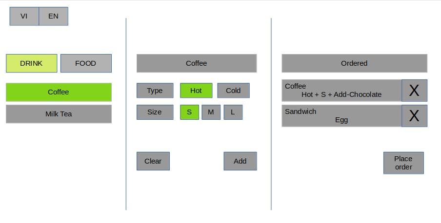

Coffee-shop helper program
***To help the coffee shop to manage the ordering of their customer***
===

# Product direction

> I want to delivery to the coffee-shop

- What kind of shop: small scope, less staff, 

- What thing I provide to them: an order app that help them to accelerate their ordering, pricing as fast as possible

- Why:
	1. I used to work for a coffee-shop and ordering fast, easily use, and manage the profit after each day can make the owner feel satisfy; and the staff satisfy. And just let the customer decide.
	2. give us time to grow with the shop requirement: we can improve other features while waiting for coffee-shop feedback

- What matters:
	1. Increase the ability to make change: by modulization each part.
	2. Focus on each module: make it fast
	3. Focus on accessibility and UX

- How to do: *By doing below features*
			

# Modules

1. Module 1: calculate price

	- Direction: anyone can use this function: customer, cashier,... whoever with a phone +  QR code to the web.

	- Purpose: allow user to calcualte price of given the information of an item

	- Use cases:
		1. When user want to buy an coffee with these info: hot, size L, adding chocolate sauce. 
			- This feature can help cashier calcualte the price of this coffee.

		2. When cashier choose the info according to customer desire: this feature can help cashier validate the info:
			- There is a constraint that hot drink only has size M or S. If customer choose hot and size L: the program can notify the cashier that: this is invalid drink info

2. Module 2: UI for selecting Item and pricing

	- Direction: simple, easily use without instruction

	- Purpose: supply cashiers an UI so that they can graphically select item info and calculate the price of item and the UI work in both computer and mobile devices

	

	1. Feature 1: Place multiple item into an order
		- Purpose: due to the fact that: an order may contain many item -> this allow cashier can calculate total order at once.

		- User cases:
			1. A customer want to buy 1 coffee and 2 milktea cups. Cashiers can select info of each item and add it into one order.

	2. Feature 2: the UI can fit in any devices
		- Purpose: to allow user can use the UI in their mobile or computer device

		- Use cases:
			1. The waiter/waitress can use their phone to place order for customer

			2. The cashier can user shop's computer to calcualte the price of customer order

	3. Feature 3: translation VI/EN
		- Purpose: to allow user can use the UI in both Vietnamese and english

		- Use cases:
			1. A foreign customer want to see the list item in english. The vietnamese cashier can switch to EN mode for the customer to pick the desired item.

	4. Feature 4: 1 Function at a time
		- Purpose: To reduce the chance of mistakes/error that user can make

		- Use cases:
			1. When waters selects info of an item. They can NOT do others function like placing the order, choose other item util they (1) Add the current item into order or (2) Cancel the current item.

3. Module 3: make it into cloud

	- Purpose: let the user can use the program anywhere only with access to the internet.

	- Use case:
		1. The user can access to the program in their phone or their lap without any installation.
