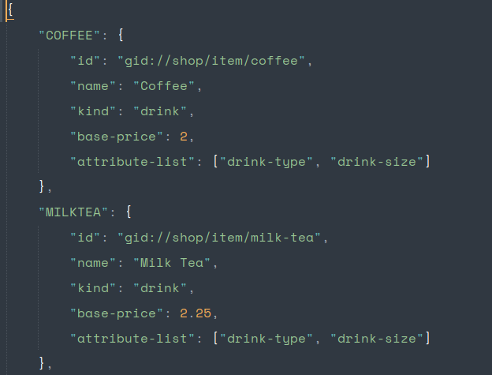
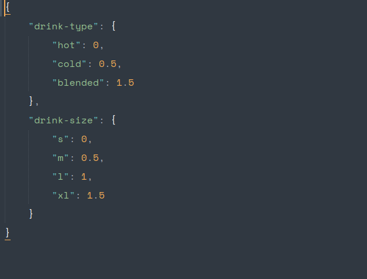

Coffee-shop application
===

> Purpose: to assist coffee-onwer, cashier, customer to calculate price of shop-item FAST and EASY-to-USE way

# Features

1. Feature 1: Set-up menu

	1. Purpose: to initial/modify the shop-menu

	2. Use cases
		- shop onwer want to initialize her/his shop product and corresponding price

	3. Descriptions
		- This feature is provided for authorized user with the right to modify menu
		- Provide a way to modify shop-menu, which is stored in database(local or cloud)

	4. Glossary
		- shop-menu: a list of item and item's options
		<!-- DESCRIBE MENU STRUCTURE -->

2. Feature 2: Seleting Item and options

	1. Purpose: to select an Item and its options

	2. Use cases
		- (Idea) Customer sit in a table with table's corresponding QR. Customer scan the QR code. App gives customer temporal ID. The customer can use that ID to selecting Item and send order to cashier.
		- Cashier can selecting item, add to order and get the price
		- Customer can selecting item to check the price before ordering

	3. Description
		1. Input: An user interface to selection item and options
		2. Output: An ItemVariant object

	4. Glossary
		- ItemVariant object: is depicted in pricing-module
		- About idea with QR code to ID: let's discuss more

3. Feature 3: Pricing
	
	1. Purpose: to get the pricing of particular item with its options

	2. Use case:
		1. User want to know the price of any item or whether the item's information is valid or not. This feature is dedicated for this reason

	3. Descriptions
		
		- Design: the pricing module is separated into a stack of 3 levels
			1. Item level: which calculate price for single item
			2. Cart-line level: which calculate price for single item + its quantity + cart-line-level-discount
			3. Cart level: which calcualte price for a cart(an order). Take care of TAX + cart-level-discount

		1. Item-level:
			- Purpose: to validate the information of the item and return corresponding price
			
			- Introduce 2 objects: Item and ItemVariant. While Item represent the static item, the ItemVariant represents particular Item when being ordered

				

			- The price of the ItemVariant is calcualed by using additional price-metric:

				

			1. Input: an ItemVariant object
			2. Output: the pricing of the ItemVariant

		2. Cart-line level:
			> No Design yet

		3. Cart level
			> No Design yet
			
4. Feature 4: Cloud
	
	1. Purpose: to let user use this application without any installation. 
	
	2. Use case
		1. User can get the QR-link then use the app
